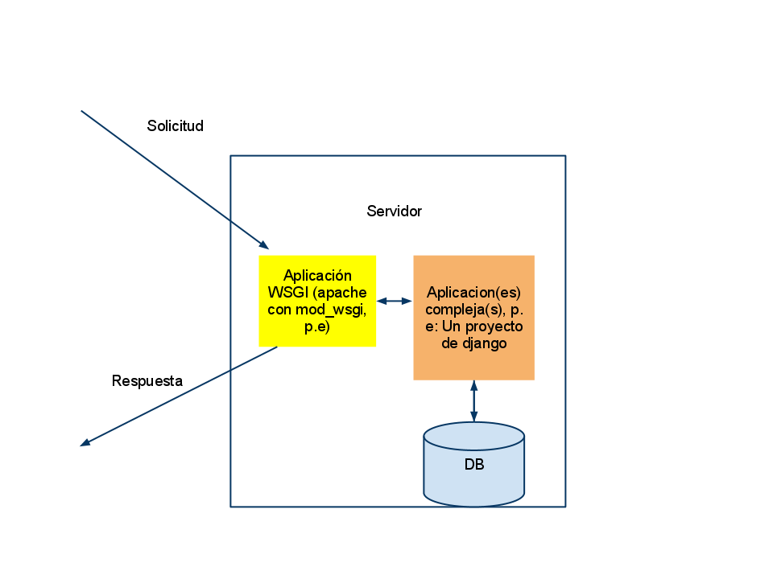

!SLIDE bullets

##En las entrañas del servidor

* Hay un "daemon" que está escuchando conexiones
* A veces él sabe qué hacer
* A veces le pasa el control a programas
* Y éstos a veces interactúan con bases de datos

!SLIDE center 

!SLIDE bullets

##¿Magia?

* WSGI: Interfaz Estándar de Servidor Web
* Una convención para escribir web-apps en python
* Todo lo demás funciona sobre ésta
* Intermediario: llena "entorno" y delega control a "controladores"

!SLIDE code small

    @@@python
    def application(environ, #entorno
                    response_callback) #constructor de respuestas
        text = 'Hola Mundo!\n'
        response_callback(
              "200 OK",
              [('Content-Type', 'text/plain'),
               ('Content-Length', str(len(text)))]
              )
        return [text] 

    from wsgiref.simple_server import make_server

    daemon = make_server('127.0.0.1', 8000, application)

    daemon.handle_request()

!SLIDE bullets

##El estándar WSGI

* Va a llamar a una función que reciba un *entorno* y un *constructor de respuestas*
* Ésta debe devolver un iterable como su cuerpo

!SLIDE bullets
##Middleware

* Software que manipula solicitudes o respuesta antes de que lleguen a nuestra aplicación
* Puede haber varias capas de middleware
* Condición: tiene que ser `callable`
* ¿Para qué sirve? Autenticación, optimización, validación, etc.
* Los frameworks suelen tener una abstracción para eso

!SLIDE code small

    @@@python
    class ReverseMiddleware:
        def __init__(self, app):
            self.wrapped_app = app

        def __call__(self, environ, start_response):
            for data in self.wrapped_app(environ,
                                start_response):
                return data[::-1]

    
    from wsgiref.simple_server import make_server
    daemon = make_server('127.0.0.1'
                         , 8000
                         , ReverseMiddleware(application))
    daemon.handle_request()

!SLIDE bullets

##Inventando realidades

* Existen varios frameworks, pero todos se basan en *abstracciones*
* Lo más básico: Solicitudes/Respuestas como objetos y no archivos
* Lo más avanzado: MVC: Modelos-Vistas-Controladores

!SLIDE code small

    @@@python 
    from webob import Request, Response

    def sum_nums(text):
    return sum([int(e) for e in text if e.isdigit()])

    def app(environ, start_response):
    request = Request(environ)
    text = ''.join(request.GET.keys())
    response = Response(content_type='text/html',
          body="""<html>
                    <body style='font-size: 250px;'>
                    %s
                    <body>
                 </html>"""%sum_nums(text))
    return response(environ, start_response)

    from paste.httpserver import serve
    serve(app)

!SLIDE bullets

##Referencias

* [Web services in python](http://k0s.org/mozilla/craft/http.html)
* [Learn WSGI](http://wsgi.org/wsgi/Learn_WSGI)
